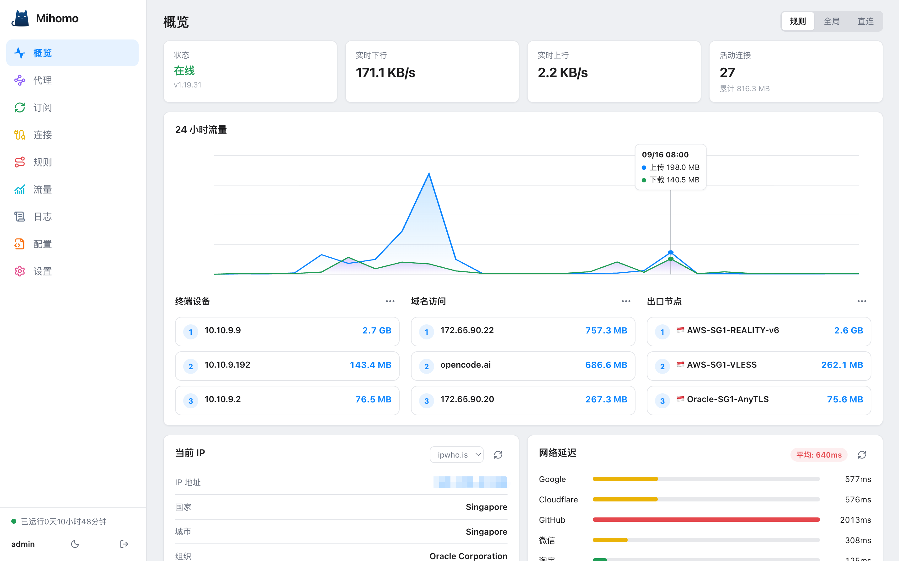
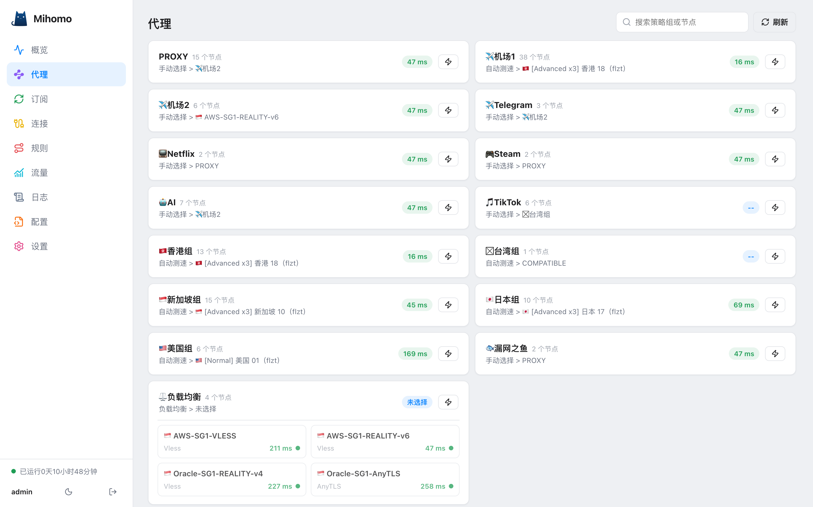
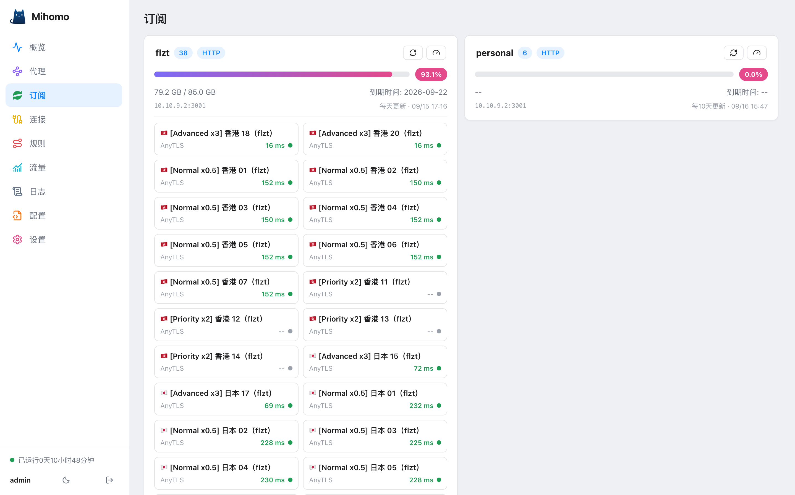
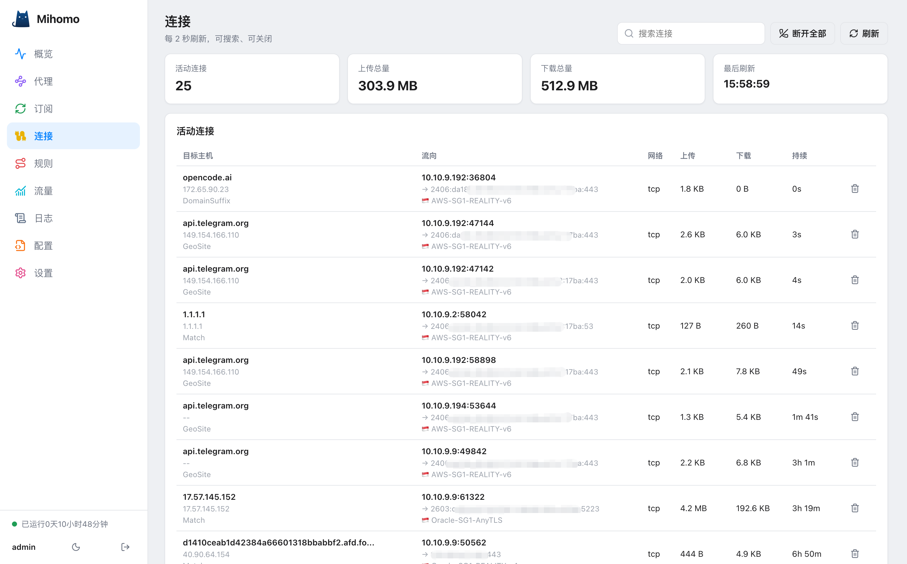
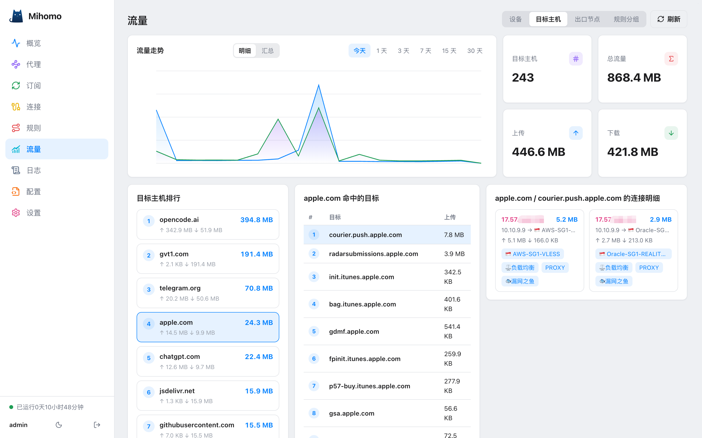
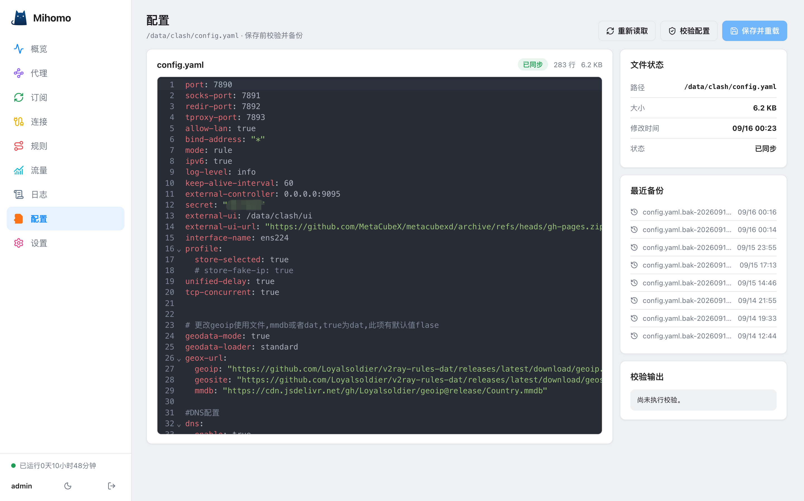
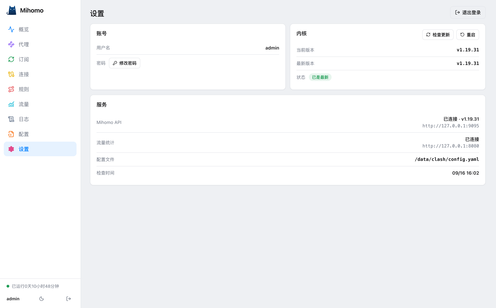

# Mihomo Console

一个跑在内网 Mihomo（Clash Meta 内核）的网页控制台：节点切换、订阅刷新、连接管理、流量统计、配置在线改，都在一个页面里完成，不用再套好几个工具。

## 界面预览










## 能做什么

- **概览**：内核在线状态、出站模式切换（规则 / 全局 / 直连）、实时上下行速率
- **代理**：策略组节点切换、延迟测试
- **订阅**：查看订阅源（节点数、更新时间、流量信息）、手动刷新订阅
- **连接**：活动连接列表、搜索、关闭连接
- **规则**：当前生效规则（只读）
- **流量**：沿用clash-traffic-monitor 的数据，需搭建先对应服务
- **配置**：直接编辑 `config.yaml`，保存前自动校验并备份，应用时热重载（不断连）
- **设置**：服务状态、内核版本与更新检查、一键重启服务、退出登录


## 目录结构
```
mihomo-console/
├── server/   # 后端（Node.js + Express），代理 Mihomo API，不向浏览器暴露 Secret
│   └── src/  # server.js / auth.js / config.js / helper.js / cli.js
├── web/      # 前端（React + Vite），部署时只用 web/dist 构建产物
└── deploy/   # install.sh / systemd 服务 / sudo 助手 / 权限白名单
```

## 本地开发

cd web && npm install && npm run dev    # 前端开发（需自行指向后端地址）
cd web && npm run build     # 构建，产物在 web/dist

`install.sh` 会自动完成：建 `mihomo-console` 系统用户、装 sudo 助手与白名单、
初始化 `/etc/mihomo-console/config.json`（含随机管理员密码）、安装并启动服务。

- 部署位置：服务器 `/opt/mihomo-console`，systemd 服务 `mihomo-console`
- 管理密码：服务器 `/root/.mihomo-console-admin-password`
- 运行配置：服务器 `/etc/mihomo-console/config.json`